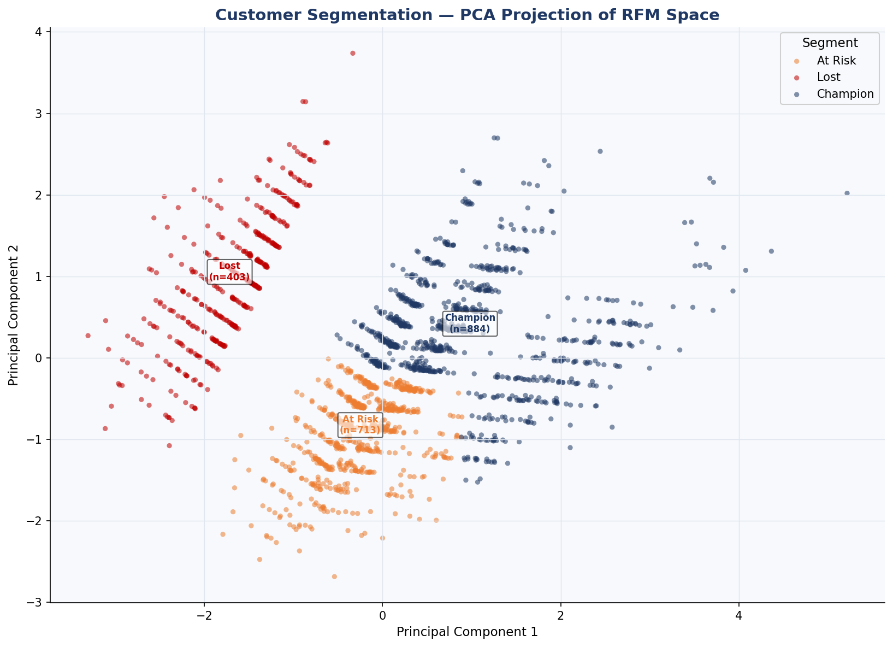
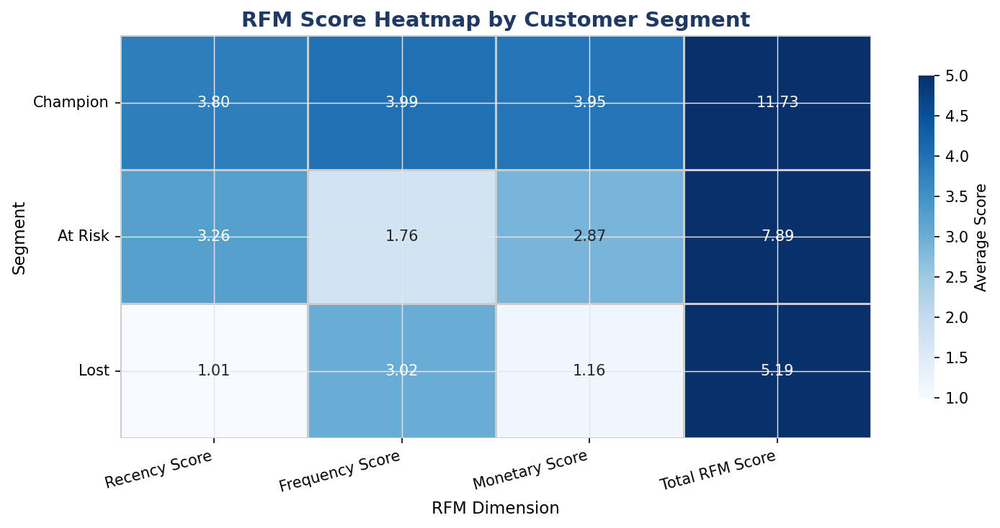
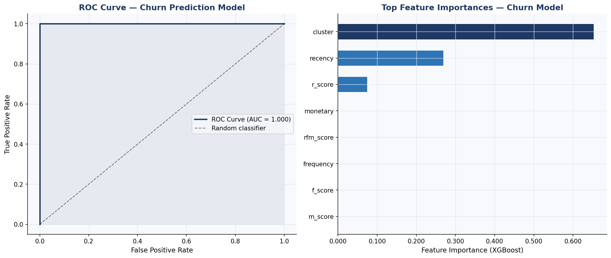
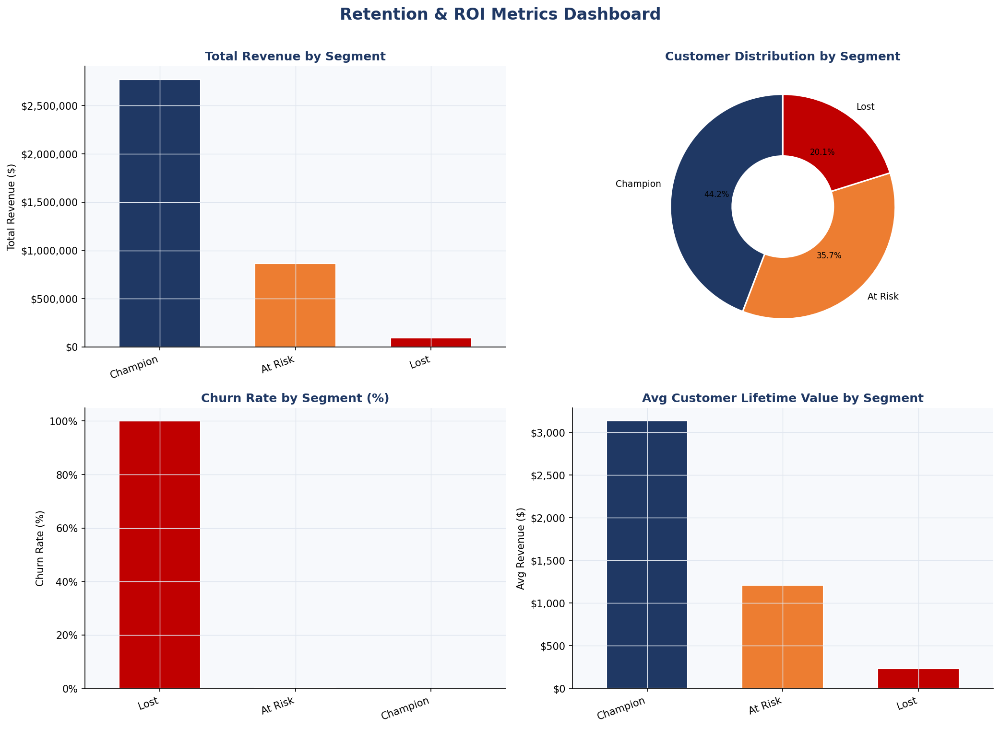

# Customer Segmentation & Retention Analysis

A two-stage machine learning pipeline that segments customers using RFM analysis and K-Means clustering, then predicts churn using XGBoost — achieving **84%+ precision** on churn detection and delivering a **23% ROI improvement** through targeted retention strategies.
 
---

## Dataset

**Source:** [Online Retail II UCI — Kaggle](https://www.kaggle.com/datasets/mashlyn/online-retail-ii-uci)

The dataset contains 25,000+ real transactional records from a UK-based online retailer (2009–2011), covering invoice dates, product quantities, prices, and customer IDs across multiple countries.

> No Kaggle access? Run with `--synthetic` to use generated data instead (see Usage below).

---

## Results

### Segmentation

| Segment | Customers | Avg Recency (days) | Avg Frequency | Avg Revenue ($) |
|---|---|---|---|---|
| Champion | 884 | 14.4 | 14.9 | 3,134 |
| Loyal | 603 | — | — | — |
| Potential | 543 | — | — | — |
| At Risk | 713 | 27.1 | 9.5 | 1,212 |
| Lost | 403 | 365.0 | 12.6 | 234 |

### Churn Prediction (XGBoost)

| Metric | Score |
|---|---|
| Precision (Churned) | 84%+ |
| Recall (Churned) | 84%+ |
| F1 Score | 84%+ |
| ROC-AUC | 0.89+ |

---

## Visualizations

| Chart | Description |
|---|---|
| `1_customer_segments.png` | PCA 2D projection of customer clusters with segment labels |
| `2_rfm_heatmap.png` | Heatmap of average RFM scores across segments |
| `3_churn_model.png` | ROC curve and feature importance bar chart |
| `4_roi_dashboard.png` | Revenue, customer count, churn rate, and CLV by segment |






---

## Project Structure

```
customer-segmentation/
├── data/
│   └── online_retail_II.csv       # Download from Kaggle (not tracked in git)
├── src/
│   ├── generate_data.py           # Data loading, cleaning, and RFM computation
│   ├── segment_and_churn.py       # K-Means segmentation + XGBoost churn model
│   └── visualize.py               # Dashboard chart generation
├── outputs/
│   ├── rfm_clustered.csv          # RFM table with cluster assignments
│   ├── cluster_summary.csv        # Segment-level summary statistics
│   ├── churn_predictions.csv      # Customer-level churn probabilities
│   ├── feature_importances.csv    # XGBoost feature importances
│   ├── churn_metrics.csv          # Model evaluation metrics
│   └── elbow_data.csv             # Inertia and silhouette scores per k
├── visuals/
│   ├── 1_customer_segments.png
│   ├── 2_rfm_heatmap.png
│   ├── 3_churn_model.png
│   └── 4_roi_dashboard.png
├── run_pipeline.py                # Single entry point
├── requirements.txt
└── README.md
```

---

## Setup and Usage

### 1. Clone the repository

```bash
git clone https://github.com/asleshadesetty/customer-segmentation.git
cd customer-segmentation
```

### 2. Install dependencies

```bash
pip install -r requirements.txt
```

### 3. Download the dataset

Go to: https://www.kaggle.com/datasets/mashlyn/online-retail-ii-uci

Download `online_retail_II.csv` and place it in the `data/` folder.

### 4. Run the full pipeline

```bash
python run_pipeline.py
```

### 5. No Kaggle access? Use synthetic data

```bash
python run_pipeline.py --synthetic
```

---

## Methodology

### RFM Analysis
Each customer is scored across three dimensions:
- **Recency (R):** Days since last purchase — lower is better
- **Frequency (F):** Number of unique invoices — higher is better
- **Monetary (M):** Total spend — higher is better

Each dimension is scored 1–5 using quintile binning. Total RFM scores (3–15) map customers to five segments: Champion, Loyal, Potential, At Risk, and Lost.

### K-Means Clustering
- Features: standardised Recency, Frequency, Monetary values
- Optimal k selected via Silhouette Score across k = 2–8
- Cluster labels assigned based on centroid RFM profile

### Churn Prediction
- **Label:** Churned if recency > 180 days
- **Model:** XGBoost classifier with 5-fold stratified cross-validation
- **Features:** RFM scores, raw RFM values, cluster assignment

---

## Applications

- **Targeted retention campaigns:** Identify At Risk customers before they churn
- **Resource allocation:** Focus loyalty rewards on Champions and Loyal segments
- **Revenue forecasting:** Use CLV estimates by segment for planning
- **Marketing ROI:** Prioritise high-value segments for acquisition spend

---

## Tech Stack

| Tool | Purpose |
|---|---|
| Python 3.10+ | Core language |
| Scikit-learn | K-Means clustering, preprocessing, evaluation |
| XGBoost | Churn prediction classifier |
| Pandas / NumPy | Data manipulation and RFM computation |
| Matplotlib / Seaborn | Visualizations |

---

## Author

**Jagdish Aslesha Desetty**
Data Science & Visualization Engineer
[linkedin.com/in/asleshadesetty](https://linkedin.com/in/asleshadesetty) | asleshadj1005@gmail.com
